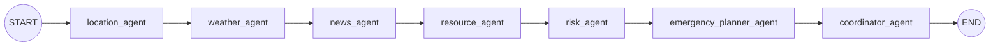
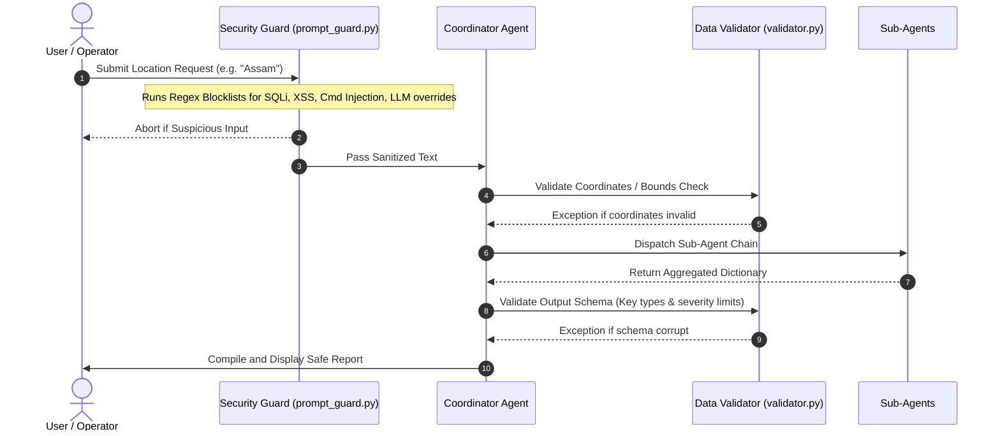

# 🏗️ CrisisNet AI - System Architecture & Workflows

This document outlines the detailed system architecture, multi-agent collaboration graph, and runtime execution sequences of CrisisNet AI.

---

## 🗺️ System Topology

CrisisNet AI is designed as a modular, secure, and fault-tolerant multi-agent platform. It operates under a hierarchical master-worker pattern combined with graph-based workflow execution.

```mermaid
graph TD
    User([User Prompt / Location]) -->|1. Raw Input| SG[prompt_guard.py]
    SG -->|2. Sanitized Input| CO[coordinator.py / CoordinatorAgent]
    CO -->|3. Validate Coordinates/Place| VA[validator.py]
    
    subgraph Multi-Agent Core
        CO -->|4. Resolve Name| LA[location_agent.py]
        LA -->|5. Coordinates & Country| WEA[weather_agent.py]
        LA -->|5. Coordinates & Country| REA[resource_agent.py]
        LA -->|5. Coordinates & Country| NEA[news_agent.py]
        
        WEA -->|6. Atmospheric Data| RIA[risk_agent.py]
        NEA -->|6. Relevant Headlines| RIA[risk_agent.py]
        REA -->|6. Resource Scarcity| RIA[risk_agent.py]
        
        RIA -->|7. Risk Score & Severity| EPA[emergency_planner.py]
    end
    
    subgraph Tool Abstraction Layer (MCP Server)
        LA -.->|Tool Call| LT[location_tool / Nominatim & Google Geocoding]
        WEA -.->|Tool Call| WT[weather_tool / Open-Meteo]
        REA -.->|Tool Call| RT[maps_tool / OSM Overpass API]
        NEA -.->|Tool Call| NT[news_tool / NewsAPI]
    end
    
    EPA -->|8. Safety Action Items| CO
    CO -->|9. Output Schema Check| VA
    CO -->|10. Final Disaster Report| UI[streamlit_app.py Dashboard]
```

---

## 🔄 Agent Workflows

CrisisNet AI implements two execution channels:
1. **Rule-Based Orchestration (Local & Offline):** Fast, reliable, deterministic execution path utilizing REST services or local fallbacks.
2. **Google ADK Workflow (Live LLM):** Leveraging Vertex AI / Gemini models to orchestrate agent-to-agent delegation via an ADK Graph Workflow.

### ADK Workflow Execution Graph

In ADK mode, the agents function as graph nodes. The execution path follows a sequence from `START` to compiling output at the `coordinator_agent`:



---

## 🔒 Security Gate Sequence

The platform enforces zero-trust validation checks at the entry and exit points of the orchestrator to prevent prompt injection, tool misuse, and data corruption.


